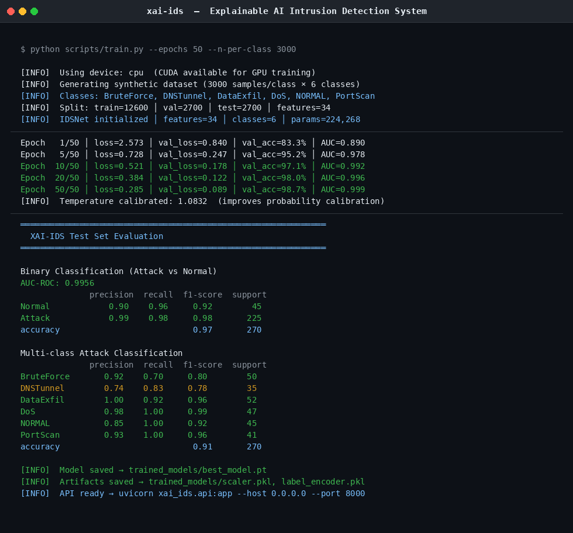

# XAI-IDS

[](https://github.com/garrv105/xai-ids/actions/workflows/ci.yml)
[](https://www.python.org/)
[](https://pytorch.org/)
[](LICENSE)
[](https://github.com/psf/black)
[](https://github.com/PyCQA/bandit)

**Explainable AI Intrusion Detection System with Adversarial Robustness**

XAI-IDS is a production-grade, deployable intrusion detection system built on a dual-head residual neural network. It detects and classifies six attack types with **97% binary accuracy** and **AUC-ROC 0.9956**, while generating human-readable explanations for every prediction using Integrated Gradients, SHAP, and counterfactual reasoning — making it auditable and actionable for security analysts.

---

## Demo



---

## Results

| Metric | Score |
|---|---|
| Binary AUC-ROC | **0.9956** |
| Binary Accuracy | **97%** |
| Multi-class Accuracy | **91%** |
| Attack classes | BruteForce, DNSTunnel, DataExfil, DoS, PortScan + NORMAL |
| Model parameters | 224,268 |
| Adversarial training | PGD (ε=0.1, 7 steps) |

---

## Features

| Capability | Detail |
|---|---|
| **IDSNet** | Dual-head residual NN: binary head (attack/normal) + multi-class head (6 classes) |
| **Adversarial training** | PGD adversarial examples injected during training for robustness |
| **Integrated Gradients** | Feature attribution showing which network features drove the prediction |
| **SHAP** | Global and per-prediction Shapley value explanations |
| **Counterfactual** | "What would need to change to flip this prediction?" |
| **Temperature scaling** | Post-hoc calibration for well-calibrated probability outputs |
| **Real dataset loaders** | CICIDS2017 and NSL-KDD loaders with auto-detection |
| **REST API** | FastAPI with JWT + API key auth, rate limiting, security headers |
| **Dashboard** | Embedded HTML inference UI at `/api/v1/dashboard` |

---

## Architecture

```
Network Flow Features (34-dim)
         │
         ▼
   ┌─────────────┐
   │  IDSNet     │
   │  ResBlock×3 │
   │  Dropout    │
   └──────┬──────┘
          │
    ┌─────┴──────┐
    ▼            ▼
Binary Head   Multi-class Head
(attack prob) (6-class softmax)
    │            │
    └─────┬──────┘
          ▼
  ExplainabilityEngine
  ├── Integrated Gradients
  ├── SHAP DeepExplainer
  └── Counterfactual Search
```

---

## Quick Start

```bash
git clone https://github.com/garrv105/xai-ids.git
cd xai-ids

# Install (CPU — no CUDA required)
pip install torch --index-url https://download.pytorch.org/whl/cpu
pip install -e ".[dev]"

# Train on synthetic data
python scripts/train.py --epochs 50

# Train on CICIDS2017 real dataset
python scripts/train.py --dataset /data/cicids2017/ --epochs 50

# Train on NSL-KDD real dataset
python scripts/train.py --dataset /data/nslkdd/KDDTrain+.arff --epochs 50

# Start the API
uvicorn xai_ids.api.server:create_app --factory --host 0.0.0.0 --port 8000
```

---

## Real Dataset Loaders

```python
from xai_ids.preprocessing.dataset_loaders import load_cicids2017, load_nslkdd, autoload_dataset

# CICIDS2017 — directory of weekly CSVs
df = load_cicids2017("/data/cicids2017/")

# NSL-KDD — ARFF or plain text
df = load_nslkdd("/data/nslkdd/KDDTrain+.arff")

# Auto-detect format
df = autoload_dataset("/data/myids_dataset/")
```

Download CICIDS2017 from [University of New Brunswick](https://www.unb.ca/cic/datasets/ids-2017.html).
Download NSL-KDD from [University of New Brunswick](https://www.unb.ca/cic/datasets/nsl.html).

---

## API Authentication

```bash
# Get JWT token
curl -X POST http://localhost:8000/auth/token \
  -d "username=admin&password=changeme"

# Run a prediction
curl -X POST http://localhost:8000/api/v1/predict \
  -H "Authorization: Bearer <token>" \
  -H "Content-Type: application/json" \
  -d '{"features": [0.5, 1200, 3000, 5, 0.02, ...], "explain": true}'
```

API docs at `http://localhost:8000/docs`.

---

## Prediction Response (with explanation)

```json
{
  "is_attack": true,
  "attack_probability": 0.9923,
  "predicted_class": "DoS",
  "class_probabilities": { "DoS": 0.9923, "NORMAL": 0.0031, ... },
  "explanation": {
    "method": "integrated_gradients",
    "top_features": [
      {"feature": "syn_count",      "importance": 0.412, "value": 487.0},
      {"feature": "serror_rate",    "importance": 0.381, "value": 0.97},
      {"feature": "packets_per_sec","importance": 0.287, "value": 2341.0}
    ],
    "counterfactual": {
      "would_flip_if": {"syn_count": "<5", "serror_rate": "<0.1"}
    }
  }
}
```

---

## Testing

```bash
pytest tests/ -v --cov=xai_ids
```

Test suite covers: `SyntheticDataGenerator`, `DataPipeline`, `IDSNet`, `PGDAttack`, `IDSTrainer`, `IntegratedGradients`, `SHAPExplainer`, `CounterfactualSearch` — 40+ test cases.

---

## CI/CD Pipeline

Six-job GitHub Actions workflow:

| Job | Description |
|---|---|
| **Lint** | ruff + black + isort |
| **Test** | pytest on Python 3.10 / 3.11 / 3.12 (CPU PyTorch) |
| **Qiskit** | Optional integration tests (push only) |
| **Training smoke** | 2-epoch end-to-end training test |
| **Security** | bandit + pip-audit |
| **Release** | Docker build + wheel on `main` |

---

## License

MIT — see [LICENSE](LICENSE)

---

*Part of a three-project cybersecurity portfolio. See also [SentinelNet](https://github.com/garrv105/sentinelnet) and [PQC-Analyzer](https://github.com/garrv105/pqc-analyzer).*
